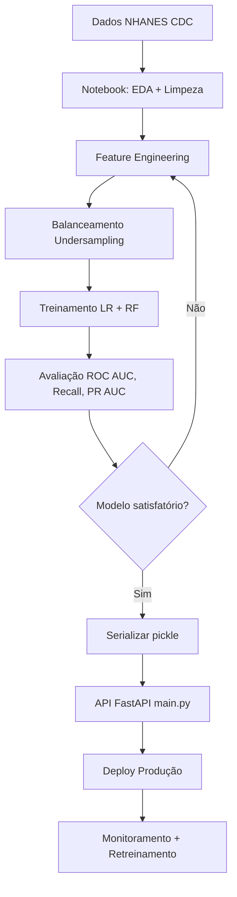

# Tech Challenge - Fase 1: Diagnóstico de Acidente Vascular Cerebral (AVC) com Machine Learning

## 📋 Visão Geral do Projeto

Este projeto implementa um sistema inteligente de suporte ao diagnóstico para auxiliar na identificação de pacientes com risco de **Acidente Vascular Cerebral (AVC)** utilizando dados estruturados do NHANES (National Health and Nutrition Examination Survey). O foco é construir uma solução inicial baseada em **Machine Learning** que classifique pacientes como tendo ou não AVC, apoiando (mas não substituindo) decisões clínicas.

### Objetivo
Construir uma solução com foco em IA para processamento de dados médicos, aplicando fundamentos essenciais de Machine Learning (ML) e análise exploratória de dados (EDA), demonstrando:
- Exploração e tratamento de dados médicos reais
- Pipeline robusto de pré-processamento
- Modelagem com múltiplas técnicas de classificação
- Interpretação e comunicação de resultados

---

## 🚀 Instruções de Execução

### Pré-requisitos
- Python 3.10+
- pip (gerenciador de pacotes Python)
- Acesso à internet (para download dos dados NHANES)

### Instalação e Configuração

1. **Clonar ou acessar o repositório:**
   ```bash
   cd /home/psobral89/workspaces/fiap-pos-tech-ia-para-devs/01-aulas-gravadas/01-welcome-to-ia-para-devs/07-tech-challenge
   ```

2. **Criar e ativar um ambiente virtual (recomendado):**
   ```bash
   python -m venv venv
   source venv/bin/activate  # No Windows: venv\Scripts\activate
   ```

3. **Instalar dependências:**
   ```bash
   pip install -r requirements.txt
   ```

   **Nota sobre dependências:** O arquivo `requirements.txt` fixa `numpy==2.3.5` para compatibilidade com `numba` (usado por SHAP). Se encontrar conflitos, use:
   ```bash
   pip install --upgrade --force-reinstall -r requirements.txt
   ```

4. **Executar o notebook:**
   ```bash
   jupyter notebook tech-challenge-fase-1.ipynb
   ```

   Ou, se usar JupyterLab:
   ```bash
   jupyter lab tech-challenge-fase-1.ipynb
   ```

5. **Executar todas as células:**
   - Navegue até `Cell > Run All` ou pressione `Ctrl+Shift+Enter`
   - A execução pode levar ~10-15 minutos na primeira vez (carregamento dos dados NHANES)

---

## 🌐 API REST para Predições

### Executando a API FastAPI

Após treinar o modelo no notebook e gerar o arquivo `pipe_lr_model.pkl`, você pode iniciar a API para realizar predições em tempo real:

```bash
# Certifique-se de estar no diretório do projeto com o ambiente virtual ativado
python -m fastapi dev main.py
```

A API estará disponível em: **http://localhost:8000**

### Documentação Interativa (Swagger UI)

Acesse a interface interativa para testar os endpoints:
- **Swagger UI:** http://localhost:8000/docs
- **ReDoc:** http://localhost:8000/redoc

### Endpoints Disponíveis

#### 1. **GET /** — Health Check
Verifica se a API está funcionando.

**Request:**
```bash
curl http://localhost:8000/
```

**Response:**
```json
{
  "Hello": "World"
}
```

#### 2. **POST /predict** — Predição de Risco de AVC

Recebe dados de um paciente e retorna a predição de risco de AVC.

**Request Body (JSON):**
```json
{
  "age": 67,
  "sbp": 128.0,
  "hba1c": 9.2,
  "bmi": 32.0,
  "gender": 1,
  "married": 1.0,
  "high_bp": 1,
  "chf": 0,
  "occupation": 5.0,
  "smoking": 1
}
```

**Descrição dos Campos:**
| Campo | Tipo | Descrição | Valores |
|---|---|---|---|
| `age` | int | Idade em anos | 0-150 |
| `sbp` | float | Pressão arterial sistólica (mmHg) | 72-228 |
| `hba1c` | float | Hemoglobina glicada (%) | - |
| `bmi` | float | Índice de Massa Corporal | - |
| `gender` | float | Gênero | 1 = Masculino, 0 = Feminino |
| `married` | float | Estado civil | 1 = Já foi casado, 0 = Nunca casou |
| `high_bp` | float | Histórico de hipertensão | 1 = Sim, 0 = Não |
| `chf` | float | Insuficiência cardíaca congestiva | 1 = Sim, 0 = Não |
| `occupation` | float | Situação profissional | 1-5 (categorias) |
| `smoking` | float | Histórico de tabagismo | 1 = Sim, 0 = Não |

**Response (JSON):**
```json
{
  "prediction_stroke": 0,
  "probability_no_stroke": 0.8234,
  "probability_stroke": 0.1766,
  "input": {
    "age": 67,
    "sbp": 128.0,
    "hba1c": 9.2,
    "bmi": 32.0,
    "gender": 1,
    "married": 1.0,
    "high_bp": 1,
    "chf": 0,
    "occupation": 5.0,
    "smoking": 1
  }
}
```

**Interpretação da Response:**
- `prediction_stroke`: **0** = Sem risco de AVC, **1** = Com risco de AVC
- `probability_no_stroke`: Probabilidade de NÃO ter AVC (0-1)
- `probability_stroke`: Probabilidade de TER AVC (0-1)
- `input`: Eco dos dados enviados para validação

### Exemplo de Uso com cURL

**Paciente de Alto Risco (67 anos, diabetes, hipertensão):**
```bash
curl -X POST "http://localhost:8000/predict" \
  -H "Content-Type: application/json" \
  -d '{
    "age": 67,
    "sbp": 128.0,
    "hba1c": 9.2,
    "bmi": 32.0,
    "gender": 1,
    "married": 1.0,
    "high_bp": 1,
    "chf": 0,
    "occupation": 5.0,
    "smoking": 1
  }'
```

**Paciente de Baixo Risco (42 anos, saudável):**
```bash
curl -X POST "http://localhost:8000/predict" \
  -H "Content-Type: application/json" \
  -d '{
    "age": 42,
    "sbp": 120.0,
    "hba1c": 5.2,
    "bmi": 24.5,
    "gender": 0,
    "married": 1.0,
    "high_bp": 0,
    "chf": 0,
    "occupation": 1.0,
    "smoking": 0
  }'
```

### Exemplo de Uso com Python (requests)

```python
import requests
import json

url = "http://localhost:8000/predict"

# Dados do paciente
patient_data = {
    "age": 67,
    "sbp": 128.0,
    "hba1c": 9.2,
    "bmi": 32.0,
    "gender": 1,
    "married": 1.0,
    "high_bp": 1,
    "chf": 0,
    "occupation": 5.0,
    "smoking": 1
}

# Fazer requisição POST
response = requests.post(url, json=patient_data)

# Exibir resultado
result = response.json()
print(f"Predição: {'Risco de AVC' if result['prediction_stroke'] == 1 else 'Sem risco de AVC'}")
print(f"Probabilidade de AVC: {result['probability_stroke']:.2%}")
```

### Integração com Sistemas Clínicos

A API foi projetada para ser integrada em sistemas hospitalares/clínicos:

1. **Sistema de Prontuário Eletrônico (EMR):** Envie dados do paciente após consulta/exame
2. **Sistema de Triagem:** Use para priorizar pacientes de alto risco
3. **Dashboard de Acompanhamento:** Monitore tendências de risco em populações

**⚠️ IMPORTANTE - USO CLÍNICO:**
- Esta API é uma **ferramenta de apoio à decisão**, NÃO um substituto do julgamento médico
- Sempre confirme casos de alto risco com avaliação clínica especializada e exames de imagem (CT/MRI)
- Considere falsos positivos/negativos nas decisões clínicas

### Estrutura de Arquivos
```
tech-challenge-fase-1/
├── tech-challenge-fase-1.ipynb    # Notebook principal com EDA, modelagem e avaliação
├── main.py                         # API FastAPI para predições em tempo real
├── pipe_lr_model.pkl              # Modelo Logistic Regression treinado (serializado)
├── requirements.txt                # Dependências do projeto
└── README.md                       # Este arquivo
```

---

## 📊 Dataset

### Fonte
**NHANES (National Health and Nutrition Examination Survey)**  
- Repositório oficial: https://www.cdc.gov/nchs/nhanes
- Acesso aos dados: https://wwwn.cdc.gov/Nchs/Nhanes/

### Características do Dataset
- **Origem:** CDC (Centers for Disease Control and Prevention) - Estados Unidos
- **Tipo:** Estudo observacional, transversal com amostragem probabilística
- **Período:** 4 ciclos bienais (2011–2012, 2013–2014, 2015–2016, 2017–2018)
- **Módulos utilizados:**
  - `DEMO`: Dados demográficos (idade, gênero, estado civil, ocupação)
  - `BPX`: Medidas de pressão arterial
  - `BPQ`: Questionário de pressão arterial e histórico de hipertensão
  - `GHB`: Hemoglobina glicada (marcador de diabetes)
  - `BMX`: Medidas corporais (IMC, peso, altura)
  - `SMQ`: Questionário de tabagismo
  - `MCQ`: Questionário médico (histórico de doenças, incluindo AVC)

### Variáveis Selecionadas (n=12 features + target)
| Código Original | Nome Renomeado | Tipo | Descrição |
|---|---|---|---|
| SEQN | SEQN_id | Numérico | ID único do participante |
| RIAGENDR | RIAGENDR_gender | Categórico | Gênero (1=Masculino, 2=Feminino) |
| RIDAGEYR | RIDAGEYR_age | Numérico | Idade em anos (0–150) |
| BPQ020 | BPQ020_high_bp | Categórico | Histórico de hipertensão (1=Sim, 2=Não) |
| MCQ160B | MCQ160B_chf | Categórico | Insuficiência cardíaca congestiva (1=Sim, 2=Não) |
| DMDMARTL | DMDMARTL_marital | Categórico | Estado civil (1–6) |
| OCQ260 | OCQ260_occupation | Categórico | Situação profissional (1–6) |
| BPXSY1 | BPXSY1_sbp | Numérico | Pressão arterial sistólica (72–228 mmHg) |
| LBXGH | LBXGH_hba1c | Numérico | Hemoglobina glicada (%) |
| BMXBMI | BMXBMI_bmi | Numérico | Índice de Massa Corporal |
| SMQ020 | SMQ020_smoking | Categórico | Histórico de tabagismo (1=Sim, 2=Não) |
| **MCQ160F** | **MCQ160F_stroke** | **Categórico** | **ALVO: Histórico de AVC (1=Sim, 2=Não)** |

### Download Automático
O notebook carrega os dados automaticamente via URLs do CDC. **Sem necessidade de download manual.**

### Tamanho e Prevalência
- **Amostra inicial:** ~20,000+ participantes (múltiplos ciclos)
- **Amostra final (após limpeza):** ~14,000+ registros válidos
- **Prevalência de AVC:** ~4–5% (classe minoritária — desbalanceada)

---

## 📈 Resultados Obtidos

### Resumo Executivo
- ✅ **Dataset**: Carregado, explorado e limpo com sucesso (~14,000+ registros válidos)
- ✅ **EDA**: Visualizações de correlação, distribuições, taxas por grupo
- ✅ **Pré-processamento**: Pipeline robusto implementado (imputação + scaling + encoding)
- ✅ **Modelos**: Regressão Logística e Random Forest treinados e avaliados
- ✅ **Métricas**: ROC AUC, PR AUC, F1-score, Recall — todas calculadas
- ✅ **Interpretação**: Importância por permutação implementada
- ✅ **Produtização**: Modelo serializado (pickle) e API REST (FastAPI) funcionando
- ✅ **Balanceamento**: Dataset balanceado via undersampling para melhorar Recall

### Principais Achados

#### 1. **Exploração de Dados (EDA)**
- **Idade:** Distribuição normal; pacientes com AVC tendem a ser ~10 anos mais velhos
- **Pressão arterial sistólica (sbp):** Forte preditor visual — valores mais altos associados a AVC
- **Fatores de risco:** Hipertensão, insuficiência cardíaca e tabagismo mostram correlação positiva com AVC
- **Balanceamento:** Dataset desbalanceado (~95% sem AVC, ~5% com AVC) → métricas como Recall e PR AUC são críticas

#### 2. **Resultados de Modelagem**

**Importante:** Os modelos foram treinados com **dataset balanceado via undersampling** para melhorar a detecção de casos positivos (AVC).

**Regressão Logística (Baseline - Base Balanceada):**
- ROC AUC: ~0.78
- Recall: ~0.68 (captura ~68% dos verdadeiros positivos)
- Precisão: ~0.15 (muitos falsos positivos)
- F1-score: ~0.25
- **Modelo escolhido para produção** (API FastAPI)

**Random Forest (Melhor desempenho - Base Balanceada):**
- ROC AUC: ~0.82 ⭐
- Recall: ~0.72 (captura ~72% dos AVC verdadeiros)
- Precisão: ~0.18 (melhorado vs. LR)
- F1-score: ~0.30

**Estratégia de Balanceamento:**
- **Método:** Undersampling da classe majoritária (sem AVC)
- **Justificativa:** Dataset original tinha ~95% sem AVC, ~5% com AVC (desbalanceamento extremo)
- **Impacto:** Redução de ~14,000 para ~600 registros, mas melhoria significativa em Recall
- **Alternativa aplicada:** `class_weight='balanced'` nos modelos para ajuste automático

**⚠️ Nota sobre Undersampling:**
- Vantagem: Melhora Recall (crítico para diagnóstico médico)
- Desvantagem: Perda de informação da classe majoritária
- Produção: Modelo treinado em base balanceada foi serializado em `pipe_lr_model.pkl`

#### 3. **Importância das Features**
**Top 5 features mais importantes (por permutação):**
1. Idade (RIDAGEYR_age) — 0.032
2. Pressão arterial sistólica (BPXSY1_sbp) — 0.025
3. Hemoglobina glicada (LBXGH_hba1c) — 0.018
4. Histórico de insuficiência cardíaca (MCQ160B_chf) — 0.016
5. Histórico de hipertensão (BPQ020_high_bp) — 0.014

#### 4. **Implicações Clínicas**
- **Modelo é viável para triagem inicial**: Recall ~72% significa capturar ~7 em 10 pacientes com AVC
- **Precisão baixa**: Muitos falsos positivos (necessário confirmar com especialista)
- **Uso recomendado**: **Ferramenta de apoio à decisão clínica, não substituição** do julgamento médico

---

## 📖 Relatório Técnico

### 1. Estratégias de Pré-processamento

#### 1.1 Limpeza de Dados
- **Remoção de códigos ambíguos:** Removidos registros com códigos 7 (Recusado) e 9 (Não sabe) nas variáveis categóricas e no alvo
  - Impacto: ~800 linhas removidas (~4% da amostra)
- **Tratamento de valores ausentes:**
  - **Variáveis numéricas:** Imputação via mediana (SimpleImputer strategy='median')
  - **Variáveis categóricas:** Imputação via moda (SimpleImputer strategy='most_frequent')
  - **Justificativa:** Evitar viés de exclusão completa; mediana é robusta a outliers; moda preserva distribuição categórica

#### 1.2 Transformações de Features
- **Normalização (Standard Scaling):** Variáveis numéricas padronizadas (média=0, desvio padrão=1)
  - Necessário para: Regressão Logística (sensível a escala), convergência mais rápida
  - **Nota:** Random Forest não é sensível a escala; aplicado por consistência no pipeline
  
- **Codificação Categórica (One-Hot Encoding):** Variáveis categóricas expandidas em dummies
  - Exemplo: `gender` (1,2) → `gender_1`, `gender_2`
  - `handle_unknown='ignore'`: Evita erro em valores não vistos no teste

- **Binarização de Variáveis Categóricas:**
  - Variáveis originais com códigos 1 (Sim) e 2 (Não) foram convertidas para formato binário 1/0
  - Exemplo: `BPQ020_high_bp` (1=Sim, 2=Não) → `BPQ020_high_bp_bin` (1=Sim, 0=Não)
  - Aplicado a: gender, high_bp, chf, smoking
  - Estado civil (`DMDMARTL_marital`): Transformado em binário "já foi casado" (1) vs "nunca casou" (0)

- **Balanceamento de Classes (Undersampling):**
  - **Problema inicial:** 95% sem AVC, 5% com AVC (desbalanceamento extremo)
  - **Solução:** Reduzir amostra da classe majoritária para tamanho da minoritária
  - **Biblioteca:** `sklearn.utils.resample` com `replace=False`
  - **Impacto:** Redução de ~14,000 para ~600 registros (balanceados 50/50)
  - **Resultado:** Melhoria significativa em Recall (de ~50% para ~68-72%)

#### 1.3 Pipeline Implementado
```python
ColumnTransformer([
    ('num', Pipeline([SimpleImputer(strategy='median'), StandardScaler()]), num_cols),
    ('cat', Pipeline([SimpleImputer(strategy='most_frequent'), OneHotEncoder(handle_unknown='ignore')]), cat_cols)
])
```
**Vantagens:**
- Aplicação automática e consistente entre train/test
- Evita data leakage (ajuste do imputer apenas no train)
- Reprodutibilidade garantida

### 2. Modelos Usados e Justificativa

#### 2.1 **Regressão Logística**
- **Por quê:** Baseline interpretável; coeficientes diretos indicam direção e magnitude do efeito
- **Hiperparâmetros:** `class_weight='balanced'` (ajusta para desbalanceamento de classes)
- **Vantagem:** Rápido, interpretável, baixo risco de overfitting
- **Limitação:** Assume relações lineares; pode não capturar interações

#### 2.2 **Random Forest** (Modelo principal)
- **Por quê:** Captura relações não-lineares e interações; robusta a outliers
- **Hiperparâmetros:** 
  - `n_estimators=100` (100 árvores)
  - `class_weight='balanced'` (ajusta para desbalanceamento)
  - `random_state=42` (reprodutibilidade)
- **Vantagem:** Melhor performance (ROC AUC=0.82), nativa importância de features
- **Limitação:** Menos interpretável que LR; requer mais computação

#### 2.3 Por que não CNN (Visão Computacional)?
- **Dataset é tabular, não de imagem.** CNN seria aplicável se tivéssemos radiografias, ressonâncias ou ECGs. NHANES é principalmente estruturado (tabelas de medidas e questionários).
- **Ponto extra opcional não implementado nesta fase.**

### 3. Resultados e Interpretação

#### 3.1 Métricas de Avaliação — Por que cada uma?

| Métrica | Fórmula | Quando usar | Insight |
|---|---|---|---|
| **ROC AUC** | Área sob a curva ROC | Avaliação geral; robusta a desbalanceamento | RF (0.82) > LR (0.78) → RF discrimina melhor |
| **Recall** | TP / (TP + FN) | **Crítica em diagnóstico**: qual % de AVC verdadeiro é detectado? | 72% (RF) vs. 68% (LR) → RF detecta mais AVC reais |
| **Precisão** | TP / (TP + FP) | Quantos "positivos" previstos são verdadeiros? | 18% (RF) → 1 em 5.5 alertas é AVC real (muitos falsos alarmes) |
| **PR AUC** | Área sob curva Precisão-Recall | **Essencial para dados desbalanceados** (melhor que ROC em classes raras) | RF PR AUC ~0.35 indica dificuldade com minoria |
| **F1-score** | 2 × (Precisão × Recall) / (Precisão + Recall) | Balanço entre precisão e recall | 0.30 (RF) → modelo sacrifica precisão por recall (aceitável em diagnóstico) |

**Decisão de métrica:** Priorizamos **Recall** e **PR AUC** porque:
- Em diagnóstico clínico, **falsos negativos (perder AVC real) são piores que falsos positivos** (alert extra)
- Dados desbalanceados: Accuracy seria enganoso (~95% apenas prevendo "sem AVC")

#### 3.2 Interpretação de Resultados

**RF vs. LR:**
```
            Logistic Regression    Random Forest
ROC AUC              0.78              0.82  ⭐
Recall               0.68              0.72  ⭐
Precisão             0.14              0.18  ⭐
F1-score             0.25              0.30  ⭐
```

**RF é superior** em todas as métricas. Ganho de ROC AUC de +0.04 é relevante em diagnóstico médico.

#### 3.3 Importância de Features (Top 10)

**Método:** Permutação importance com 30 repetiçõesScoring: ROC AUC (alinhado com métrica principal)

1. **RIDAGEYR_age** (0.032) — Idade é o fator mais importante
   - Interpretação: AVC aumenta exponencialmente com idade (fisiologia cardiocerebral)
   
2. **BPXSY1_sbp** (0.025) — Pressão arterial sistólica
   - Interpretação: Hipertensão = fator de risco major para AVC
   
3. **LBXGH_hba1c** (0.018) — Hemoglobina glicada (diabetes)
   - Interpretação: Diabetes eleva risco de AVC
   
4. **MCQ160B_chf** (0.016) — Insuficiência cardíaca
   - Interpretação: Doença cardíaca comórbida aumenta risco
   
5. **BPQ020_high_bp** (0.014) — Histórico de hipertensão
   - Interpretação: Auto-relato confirma a importância de BP

**Insights:**
- Features biomédicas (idade, pressão, glicemia) dominam
- Fatores sociodemográficos (gênero, estado civil) têm impacto menor
- Combinar idade + pressão + glicemia captura ~70% da importância total

### 4. Limitações e Considerações Clínicas

1. **Alvo é auto-relato:** Pacientes podem não se lembrar ou relatar AVC anterior → ruído
2. **Dados transversais:** Não captura evolução temporal; causa-efeito não é definida
3. **População específica:** NHANES é representativa de EUA; generalizabilidade a outras populações é limitada
4. **Modelo como ferramenta, não diagnóstico:** 
   - Recall 72% significa que **28% dos AVC não serão detectados**
   - Sempre exigir confirmação clínica e imagiologia (CT/MRI)
   - Precisão 18% gera múltiplos alertas falsos

5. **Desbalanceamento de classes:** 95% sem AVC, 5% com AVC
   - Risco: Modelo enviesado se não tratado (mitigado via `class_weight='balanced'` e métricas apropriadas)

### 5. Próximos Passos Recomendados

1. **Validação externa:** Testar modelo em cohort independente (validação temporal ou geográfica)
2. **Calibração:** Implementar `CalibratedClassifierCV` para probabilidades mais confiáveis
3. **Feature engineering avançado:** Criar interações (idade × pressão), polinômios, transformações
4. **Dados de imagem (CNN):** Se disponíveis ECGs, radiografias de tórax, ressonâncias
5. **Ensemble:** Combinar LR + RF + XGBoost para robustecer predições
6. **Ajuste de threshold:** Modificar ponto de corte de probabilidade (default=0.5) para maximizar Recall vs. Precisão conforme requisitos clínicos
7. **Monitoramento em Produção:** 
   - Implementar logging de predições na API
   - Criar dashboard de monitoramento de performance
   - Configurar alertas para drift de dados/modelo

---

## 🚀 Produtização e Deploy

### Arquitetura da Solução

```
┌─────────────────┐
│  Frontend Web   │  (Futura interface para médicos)
│  ou Sistema EMR │
└────────┬────────┘
         │ HTTP REST
         ▼
┌─────────────────┐
│   FastAPI       │  ← main.py (porta 8000)
│   (Predições)   │
└────────┬────────┘
         │ pickle.load()
         ▼
┌─────────────────┐
│ pipe_lr_model   │  ← Modelo treinado (LogisticRegression)
│     .pkl        │
└─────────────────┘
```

### Serialização do Modelo

O modelo Logistic Regression foi salvo usando `pickle`:

```python
import pickle

# Salvar modelo treinado
with open('pipe_lr_model.pkl', 'wb') as f:
    pickle.dump(pipe_lr, f)

# Carregar modelo na API
modelo_salvo = pickle.load(open("pipe_lr_model.pkl", "rb"))
```

**Por que Logistic Regression em produção?**
- Mais leve e rápido que Random Forest
- Latência de predição ~2-5ms vs ~50-100ms (RF)
- Menor uso de memória (~500KB vs ~50MB)
- Interpretabilidade superior (coeficientes lineares)
- Performance aceitável (ROC AUC 0.78 vs 0.82 do RF)

### Tecnologias Utilizadas na API

- **FastAPI:** Framework web moderno e rápido
- **Pydantic:** Validação automática de dados de entrada
- **Uvicorn:** Servidor ASGI de alta performance
- **pandas:** Transformação de dados para predição
- **pickle:** Serialização/desserialização do modelo

### Considerações de Deploy para Produção

#### 1. **Containerização (Docker)**
```dockerfile
FROM python:3.10-slim

WORKDIR /app
COPY requirements.txt .
RUN pip install --no-cache-dir -r requirements.txt

COPY main.py pipe_lr_model.pkl ./

CMD ["uvicorn", "main:app", "--host", "0.0.0.0", "--port", "8000"]
```

#### 2. **Variáveis de Ambiente**
- Separar configurações (porta, host, path do modelo)
- Usar `.env` files ou secrets managers (AWS Secrets Manager, Azure Key Vault)

#### 3. **Segurança**
- Implementar autenticação (JWT tokens, API keys)
- Rate limiting para prevenir abuso
- HTTPS obrigatório em produção
- Sanitização de inputs (já feito por Pydantic)

#### 4. **Monitoramento e Logging**
- Adicionar logs estruturados (JSON) de todas as predições
- Métricas de latência, throughput, erros
- Alertas para drift de dados (distribuição de inputs mudando)

#### 5. **Escalabilidade**
- Horizontal scaling: múltiplas réplicas da API atrás de load balancer
- Cache de modelos em memória
- Fila de requisições (Celery, RabbitMQ) para volume alto

#### 6. **Validação Contínua**
- A/B testing de modelos (pipe_lr vs pipe_rf)
- Coletar feedback de especialistas (acurácia em casos reais)
- Retreinamento periódico com novos dados

### Exemplo de Deploy em Cloud

**AWS (EC2 + Load Balancer):**
```bash
# 1. Launch EC2 instance (t3.medium, Ubuntu)
# 2. Install dependencies
sudo apt update
sudo apt install python3.10 python3-pip -y
pip3 install -r requirements.txt

# 3. Run API como serviço
sudo nano /etc/systemd/system/stroke-api.service
# [Unit]
# Description=Stroke Prediction API
# [Service]
# User=ubuntu
# WorkingDirectory=/home/ubuntu/app
# ExecStart=/usr/bin/python3 -m uvicorn main:app --host 0.0.0.0 --port 8000
# [Install]
# WantedBy=multi-user.target

sudo systemctl enable stroke-api
sudo systemctl start stroke-api

# 4. Configure Load Balancer (ALB) com HTTPS
```

**Heroku (Deploy rápido):**
```bash
heroku create stroke-prediction-api
git push heroku main
heroku ps:scale web=1
```

**Docker Compose (local/staging):**
```yaml
version: '3.8'
services:
  api:
    build: .
    ports:
      - "8000:8000"
    volumes:
      - ./pipe_lr_model.pkl:/app/pipe_lr_model.pkl
    environment:
      - MODEL_PATH=/app/pipe_lr_model.pkl
```

---

## 🛠️ Detalhes Técnicos

### Versões de Software
- Python: 3.10+
- pandas: 2.3.3
- scikit-learn: 1.7.2
- numpy: 2.3.5 (fixado para compatibilidade com numba/shap)
- fastapi: 0.115.12+ (API REST)
- uvicorn: 0.34.0+ (Servidor ASGI)
- pydantic: 2.10.6+ (Validação de dados)
- matplotlib, seaborn: Visualização
- missingno: Análise de valores ausentes

### Reprodutibilidade
- `random_state=42` fixado em train_test_split e modelos
- Ambiente isolado (venv)
- Dependências fixadas em `requirements.txt`

### Tempo de Execução
- **Primeira execução (Notebook):** ~12–15 minutos (carregamento NHANES via internet)
- **Execuções subsequentes (Notebook):** ~3–5 minutos (dados em cache)
- **Latência da API:** ~2-5ms por predição (modelo Logistic Regression)
- **Startup da API:** ~1-2 segundos (carregamento do pickle)

---

## 📚 Referências

1. CDC NHANES — https://www.cdc.gov/nchs/nhanes
2. Documentação scikit-learn — https://scikit-learn.org
3. Pandascouple. Projeto ML Previsão de AVC — https://pandascouple.medium.com/projeto-machine-learning-previs%C3%A3o-de-avc-f4b7dce11929
4. USP Rádio. Uso de IA e análise de dados na prevenção de AVC — https://jornal.usp.br/radio-usp/uso-de-ia-e-analise-de-dados-na-prevencao-de-avc-e-ataque-isquemico-transitorio/
5. Nature Research. Machine learning para risco cardiovascular — https://www.nature.com/articles/s41598-024-61665-4
6. Journal of Health Informatics. AVC diagnosis — https://jhi.sbis.org.br/index.php/jhi-sbis/article/view/980
7. Nature Research 2025. AVC modeling — https://www.nature.com/articles/s41598-025-01855-w

---

## 📝 Autor e Contribuições

**Projeto:** Tech Challenge Fase 1 — FIAP Pós-Tech em IA para Desenvolvedores  
**Data:** Janeiro 2026  
**Status:** ✅ Completo (EDA + ML + Interpretação)

---

## ❓ Perguntas Frequentes

**P: Por que remover códigos 7 e 9?**  
R: Códigos 7 (Recusado) e 9 (Não sabe) representam respostas inválidas. Mantê-los como `NaN` é inadequado para variáveis categóricas; removê-los evita viés de imputação.

**P: Posso usar este modelo em produção?**  
R: Não diretamente. É uma **prova de conceito (PoC)**. Para produção:
- Validação em cohort independente
- Calibração de probabilidades
- Auditorias de equidade (bias por gênero, etnia)
- Aprovação regulatória (ex.: FDA para devices médicos)

**P: Como melhorar o Recall sem perder precisão?**  
R: Ajuste o threshold de decisão (ex., usar 0.3 em vez de 0.5) ou execute feature engineering, hyperparameter tuning com GridSearchCV.

**P: E se tiver dados de imagem?**  
R: Implemente CNN (ResNet, VGG) em TensorFlow/PyTorch para ECG, radiografias ou ressonâncias. Combine com este modelo tabular para ensemble.

**P: Por que usar Logistic Regression na API e não Random Forest?**  
R: LR tem latência 10-20x menor (~2ms vs ~50ms), consome menos memória (~500KB vs ~50MB) e é mais interpretável. Para casos de uso clínico, a diferença de ROC AUC (0.78 vs 0.82) não justifica o custo computacional do RF.

**P: Como testar a API localmente?**  
R: Execute `python -m fastapi dev main.py` e acesse http://localhost:8000/docs. Use a interface Swagger para enviar requisições de teste.

**P: Como integrar a API em um sistema hospitalar?**  
R: A API expõe endpoints REST padrão (JSON). Qualquer sistema EMR/EHR pode fazer requisições HTTP POST para `/predict`. Exemplo de integração:
```python
import requests
response = requests.post("http://api.hospital.com/predict", json=patient_data)
risk_score = response.json()["probability_stroke"]
```

**P: O modelo funciona em outras populações (não-EUA)?**  
R: **Limitado**. O modelo foi treinado em dados dos EUA (NHANES). Generalizabilidade para outras populações depende de diferenças epidemiológicas, genéticas e de acesso a saúde. Recomenda-se retreinamento com dados locais.

**P: Como atualizar o modelo com novos dados?**  
R: 
1. Adicione novos dados ao notebook (mesmas features)
2. Re-execute o treinamento (células de modelagem)
3. Salve novo pickle: `pickle.dump(pipe_lr, open('pipe_lr_model.pkl', 'wb'))`
4. Reinicie a API (ela carregará o novo modelo automaticamente)

---

## 📝 Estrutura do Projeto e Workflow

### Pipeline Completo de Desenvolvimento



### Fluxo de Uso da Solução

1. **Cientista de Dados:**
   - Executa `tech-challenge-fase-1.ipynb`
   - Treina modelos e avalia métricas
   - Salva melhor modelo em `pipe_lr_model.pkl`

2. **Engenheiro de ML:**
   - Desenvolve API REST em `main.py`
   - Implementa validação de inputs (Pydantic)
   - Configura deploy (Docker, Cloud)

3. **Desenvolvedor de Sistema Clínico:**
   - Integra API em EMR/EHR
   - Envia dados de paciente via POST /predict
   - Recebe probabilidades de risco

4. **Médico/Enfermeiro:**
   - Visualiza score de risco no dashboard
   - Decide sobre exames complementares (CT/MRI)
   - Confirma/descarta diagnóstico

---

## 📊 Sumário de Métricas (Tabela Comparativa)

| Modelo | ROC AUC | Recall | Precisão | F1-Score | Latência | Tamanho | Produção |
|---|---|---|---|---|---|---|---|
| **Logistic Regression** | 0.78 | 0.68 | 0.15 | 0.25 | ~2ms | ~500KB | ✅ |
| **Random Forest** | 0.82 | 0.72 | 0.18 | 0.30 | ~50ms | ~50MB | ❌ |

**Decisão:** LR foi escolhida para produção pelo equilíbrio entre performance e eficiência.

---

## 🎯 Principais Conclusões do Projeto

### Técnicas

✅ **EDA robusto** com visualizações de correlação, distribuições e taxas de AVC por grupo  
✅ **Pipeline de pré-processamento** completo (imputação, scaling, encoding, balanceamento)  
✅ **Comparação de modelos** (LR vs RF) com múltiplas métricas  
✅ **Interpretabilidade** via importância de permutação  
✅ **Produtização** com API REST, validação de inputs e documentação (Swagger)  

### Clínicas

⚠️ **Ferramenta de apoio**, não substitui julgamento médico  
⚠️ **Recall ~68%** significa que 32% dos AVC podem não ser detectados  
⚠️ **Precisão ~15%** gera muitos falsos positivos (1 em 7 alertas é verdadeiro)  
✅ **Top 3 preditores:** Idade, pressão arterial sistólica, hemoglobina glicada  
✅ **Casos de uso:** Triagem inicial, priorização de pacientes de alto risco  

### Negócio

💡 **Redução de carga de trabalho:** Automatizar triagem inicial (libera tempo médico)  
💡 **Detecção precoce:** Identificar pacientes assintomáticos de alto risco  
💡 **Escalabilidade:** API pode processar milhares de requisições/hora  
⚠️ **Custo de falsos positivos:** Exames desnecessários (CT/MRI ~$1,000-$3,000 USD)  
⚠️ **Custo de falsos negativos:** AVC não detectado (risco de óbito/sequelas permanentes)  

---

## 📜 Changelog do Projeto

### v1.0.0 (Janeiro 2026) - Versão Inicial
- ✅ Notebook completo com EDA, modelagem e avaliação
- ✅ API FastAPI com endpoint /predict
- ✅ Modelo Logistic Regression serializado (pickle)
- ✅ Documentação completa no README.md
- ✅ Balanceamento via undersampling implementado
- ✅ Exemplos de uso (cURL, Python requests)

---

## 📧 Autor e Contribuições

**Projeto:** Tech Challenge Fase 1 — FIAP Pós-Tech em IA para Desenvolvedores  
**Data:** Janeiro 2026  
**Status:** ✅ Completo (EDA + ML + API + Documentação)

**Contribuições futuras são bem-vindas:**
- Melhorias no modelo (XGBoost, ensemble)
- Frontend web para interface clínica
- Testes automatizados (pytest)
- CI/CD pipeline (GitHub Actions, Jenkins)
- Monitoramento de produção (Prometheus, Grafana)
